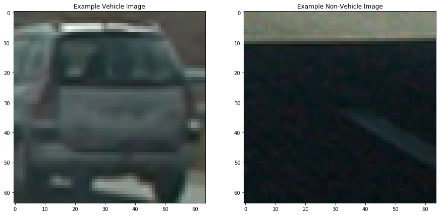
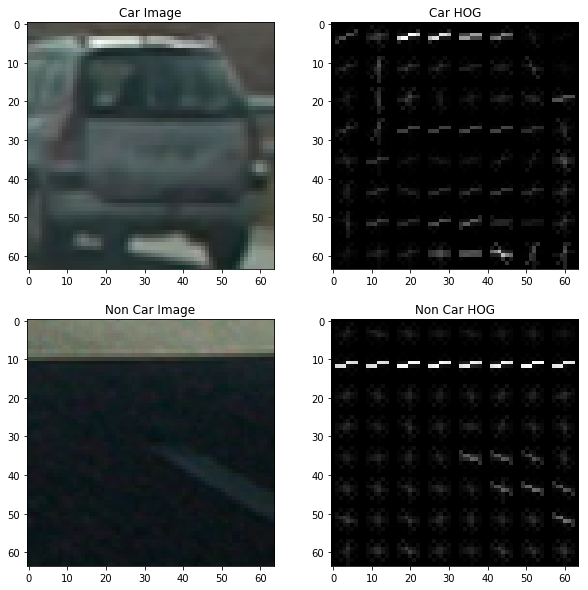
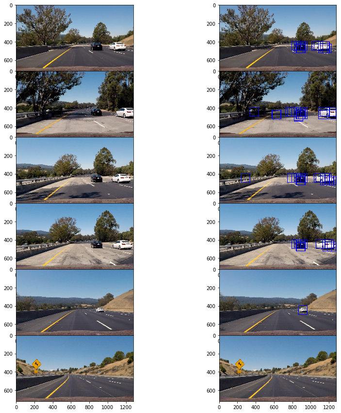
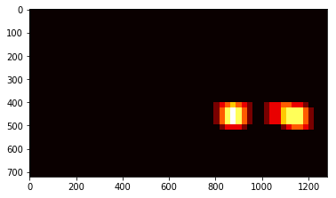

## Udacity-Self-Driving-Car-Vehicle-Detection-and-Tracking
---
**Vehicle Detection Project**

In this project, the following classical computer vision techniques were used:

* a Histogram of Oriented Gradients (HOG) was used to extract features
* histograms of color and binned color features were obtained from transformed color space
* HOG features were combined with histogram of color and binned color features
* a linear SVM classifier was trained on combined set of features using a labeled training set
* a sliding-window technique was used to search for cars with trained SVM
* a heatmap was run on recurring detections frame by frame to reject outliers and to follow detected vehicles
* pipeline was run on a video stream using shorter test_video.mp4 and also full project video project_video.mp4

## [Rubric](https://review.udacity.com/#!/rubrics/513/view) Points
### Here I will consider the rubric points individually and describe how I addressed each point in my implementation.

---
### Data Exploration

Labeled images were obtained from the [GTI](http://www.gti.ssr.upm.es/data/Vehicle_database.html) vehicle database, the 
[KITTI Vision Benchmark Suite](http://www.cvlibs.net/datasets/kitti/) and the project video itself. The total number of vehicle images was 8792, and the total number of non-vehicles images was 8968. The data set was broadly balanced. As images of the GTI data set were taken from video sequences, this was addressed via separaiton into training, validation and test set to avoid images of the same car being present across the training and testing datasets. Shown below are an examplle from each class (vehicle and not vehicle).

  

The data set was divided as follows (70% of images of each class was taken for training set, 20% was taken for the validation set (parameter tuning) and 10% was used for the testing set:

- number of vehicle images - training set: 6154, validation set: 1758, test set: 880
- number of vehicle images - training set: 6277, validation set: 1794, test set: 897

### Histogram of Oriented Gradients (HOG)

The code for this step is contained in the function get_hog_features in line 10 of the IPython notebook, different combinations of parameters were explored with final parameters as below.

colorspace = 'YCrCb' # Can be RGB, HSV, LUV, HLS, YUV, YCrCb
orient = 9
pix_per_cell = 8
cell_per_block = 2
hog_channel = 'ALL' 

An example of vehicle and non-vehicle images processed via HOG is below:

  

#### Choice of paramenets and channels for HOG.
I tried various combinations of color spaces and HOG parameters and trained a linear SVM first by using color based features and then using HOG features. The difference in performance was observed for linear SVM classifier with HOG features providing classification accuracy of almost 99% on the test set. The classification accurace using only color based features was lower at around 92% and in the final classifier I used combined (color and HOG) features obtaining test accuracy of 98.82%. For color binning spatial size was (16,16) and hist_bins = 32. Whilst classification accuracy was high, some false positives occured on images including guard rails, lane lines etc. 

### Sliding Window Search

I used Hog sub-sampling window search which is a more efficient method for doing the sliding window approach. The approach allows to only extract the Hog features once. The features can then be sub-sampled to get all of its overlaying windows. Each window is defined by a scaling factor where a scale of 1 would result in a window that's 8 x 8 cells then the overlap of each window is in terms of the cell distance. This means that a cells_per_step = 2 would result in a search window overlap of 75%. Its possible to run this same function multiple times for different scale values to generate multiple-scaled search windows. The final classifier was searchig at 4 different scales: 1, 1.5, 2, 3.5.

Examples of test images with sliding windows are below:

  

#### False positives and filtering
Filtering was implemented to store bounding boxes of the last n frames. Bounding boxes from the last n frames were then added, a heat map was applied which was then thresholded in order to filter out false positives (the idea here is that false positives are unlikely to persists from frame to frame). scipy.ndimage.measurements.label() was used to indentify individual blobs in the heatmap allowing to locate the vehicle(s) within the box(es). I constructed bounding boxes to cover the area of each blob detected.

Here is an example of a heat map.

  

### Video Implementation

Here's a [Project_video](https://youtu.be/2BuTFsSRfJw). 

---

### Discussion

The approached worked very well, detecting vehicles from frame to frame. False positives were difficult to deal with when I have implemented first version of the project. However I was able to substantially reduce false positive by obtaining better classifier and also heat map averaging. The project was an educational project to apply classical computer vision techniques in combination with classical machine learning alrgotihm such as SVM. A new more advanced approaches such as for example YOLO would be an interesting application of deep learning techniques which could provide even better results. In addition results could be imporved by using more data.  
